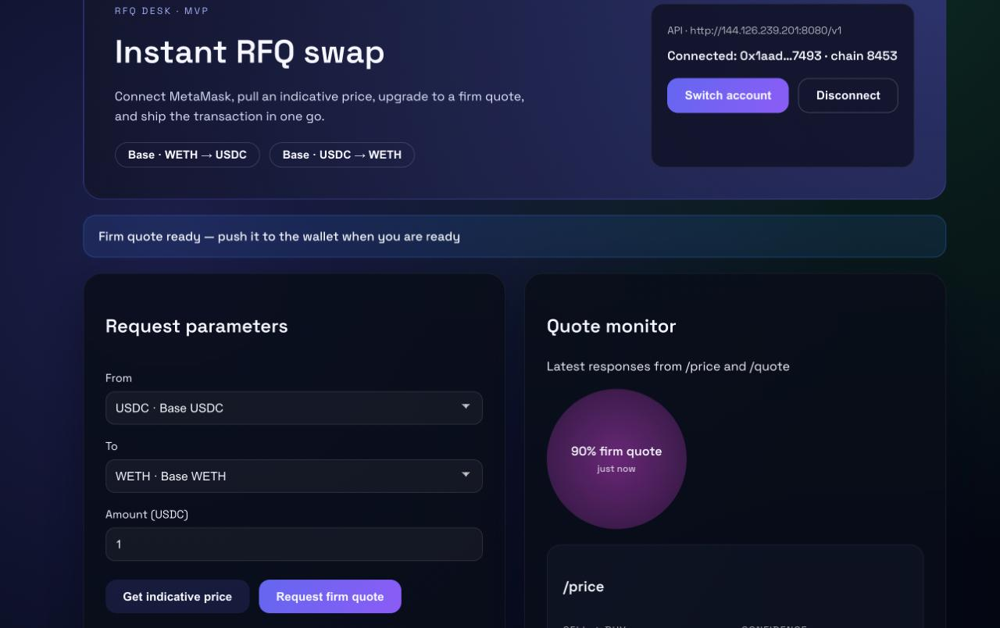
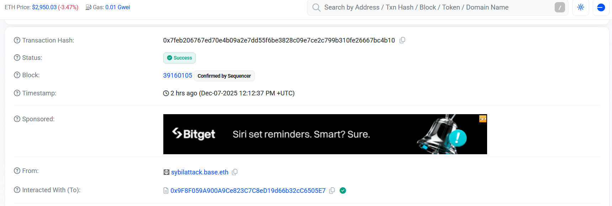

README

CryptoCatalyst: Aqua-based Agentic Strategist and Trader for Liquidity Providers

CryptoCatalyst generates trading strategies through a natural-language conversational interface agent for liquidity providers, as well as executing validated and signed token swaps on Ethereum-compatible chains. By harnessing the AQUA protocol by 1inch (https://github.com/1inch/aqua), CryptoCatalyst enables liquidity providers to earn currency by performing market-making functions and reduce their impermanence losses.  

___________________________________________________________________________________________

Links
- RFQ trading venue: http://144.126.239.201:5173/

- API link: http://144.126.239.201:8080/docs#/

Trade Samples
- Real Trade via UI: https://basescan.org/tx/0x7feb206767ed70e4b09a2e7dd55f6be3828c09e7ce2c799b310fe26667bc4b10

- Simulated Transaction: https://dashboard.tenderly.co/shared/simulation/72cff1d6-ea31-47bc-9463-a1d9c47e85a0


___________________________________________________________________________________________

Architecture: 


___________________________________________________________________________________________    

Core Components
1.	Strategy Agent (strategyAgentNew/)
•	Python Flask service that evaluates quote requests
•	Enforces maker policies (max trade size, price impact limits, stale pricing checks)
•	Computes strategy hashes (keccak256) matching on-chain computation
•	Returns ACCEPT/REJECT decisions with buy amounts, fees, and expiry
•	Deterministic: same inputs produce the same outputs
2.	Maker API (api/)
•	NestJS service orchestrating the quote flow
•	Receives quote requests from takers
•	Fetches pricing from the price engine
•	Calls the Strategy Agent for validation
•	Signs quotes using EIP-712
•	Stores quotes in PostgreSQL
•	Builds transaction payloads for on-chain execution
3.	Price Engine (price-engine/)
•	Market data service providing mid prices and liquidity depth curves
•	Aggregates data from multiple sources (DEXs, aggregators, oracles)
•	Returns depth points with price impact calculations
•	Includes quality metadata (confidence scores, staleness flags)
4.	Smart Contracts (contracts/)
•	AquaQuoteExecutor.sol: On-chain RFQ executor
•	Validates signed quotes, checks strategy status, and executes swaps
•	Integrates with Aqua for strategy-based liquidity management
•	Handles fee collection and settlement
5.	Maker Agent (makeragent/)
•	Conversational assistant for makers to configure quoting parameters
•	Helps set allowed pairs, trade limits, daily caps, and strategy selection
•	Generates transaction payloads for on-chain configuration
•	Requires explicit confirmation before any state changes
How It Works
1.	Taker requests a quote via the Maker API with token pair and amount
2.	API fetches pricing data from the Price Engine
3.	API calls the Strategy Agent with the request and pricing snapshot
4.	Strategy Agent validates against maker policies and computes:
•	Buy amount based on depth curve
•	Price impact (impactBps)
•	Fees (feeBps, feeAmount)
•	Strategy hash (on-chain compatible)
5.	If accepted, API signs the quote (EIP-712) and stores it
6.	Taker submits the signed quote to AquaQuoteExecutor on-chain
7.	Contract validates and executes the swap using Aqua strategies

   
Key Features 
- Self-custodial delegated liquidity: the assets work for you in various strategy while remaining yours
- Deterministic quoting: same inputs produce identical quotes 
- Policy enforcement: maker-defined limits and constraints 
- On-chain compatibility: strategy hashes match Solidity computation 
- Price impact optimization: buys as much as possible at better prices 
- Rejection reasons: clear codes (STALE_PRICING, MAX_IMPACT_BPS_EXCEEDED, etc.) 
- Multi-chain support: Base, BNB Chain, and others 
  
Technology Stack 
- Backend: Python (Flask), TypeScript/Node.js (NestJS) 
- Blockchain: Solidity (Foundry), Web3.py, ethers.js 
- Database: PostgreSQL with TypeORM 
- APIs: REST with Swagger/OpenAPI documentation 
- Signing: EIP-712 structured data signing 
This system enables makers to provide liquidity through configurable strategies while ensuring quotes are valid, signed, and executable on-chain.
 # Autonomous Trading Co‑Pilot (Web UI + API)

An experimental autonomous trading co‑pilot with a ChatGPT‑style web interface.  
The system is designed to:

- Interpret natural language trading intents.
- Propose trading strategies (with risk & backtest metrics).
- Eventually execute trades once approved.

Right now, the **web/API mode** uses safe synthetic strategies/trades for UX, while the deeper autonomous pipeline (MeTTa / Hyperon / MeTTa KB) is wired in but not fully enabled.

---

## Tech Stack Overview

### Backend

- **Language:** Python
- **Framework:** Flask (REST API at `/api/chat`)
- **Core file:** `Smart Chat Bot.py`
- **Planned reasoning components (in code, not fully used via API yet):**
  - **MeTTa / Hyperon**: symbolic reasoning and constraint validation for strategies.
  - **MeTTa Knowledge Base (KB):** rule‑based validation (risk, trading allowed, strategy selection).
  - **LLM Integration (ASI:One):** generates and refines strategies and risk analyses.
  - **Membase intergration** Version with terminal as user inerface has code that allows for data to be stored on the membase
- **Trading Engine Structures (dataclasses):**
  - [Strategy](cci:2://file:///c:/Users/ishaa/Smart%20Chat%20Bot.py:140:0-158:31)
  - [RiskMetrics](cci:2://file:///c:/Users/ishaa/Smart%20Chat%20Bot.py:129:0-138:24)
  - [BacktestResult](cci:2://file:///c:/Users/ishaa/Smart%20Chat%20Bot.py:160:0-172:25)
  - [AutonomousReasoning](cci:2://file:///c:/Users/ishaa/Smart%20Chat%20Bot.py:194:0-205:29)
- **Execution & Interpretation:**
  - [UserIntentInterpreter](cci:2://file:///c:/Users/ishaa/Smart%20Chat%20Bot.py:1419:0-1585:19): classifies intents (trade, config, strategy, query, cancel).
  - `ExecutionEngine`: calls the strategy generator, risk engine, and backtester.
  - [MakerAgent](cci:2://file:///c:/Users/ishaa/Smart%20Chat%20Bot.py:2910:0-3222:64) / [APIMakerAgent](cci:2://file:///c:/Users/ishaa/Smart%20Chat%20Bot.py:3246:4-3255:37): orchestrate conversation state and send responses.
- **Mode:**
  - **API mode:** `--mode api` starts Flask and responds to web UI.
  - **CLI mode (still available):** uses the full pipeline from the terminal.

### Frontend

- **Language:** TypeScript
- **Framework:** React + Vite
- **Key components:**
  - [ChatWindow.tsx](cci:7://file:///c:/Users/ishaa/trading-ui/src/components/ChatWindow.tsx:0:0-0:0) – chat UI; sends messages to Flask; renders bot/user messages.
  - `RightPanel.tsx` – shows:
    - Current strategy (pair, entry/exit, stop loss, TP, size, risk, confidence)
    - Backtest metrics
    - Risk metrics
  - `ChatLayout.tsx` – layout: chat on the left, details on the right.
- **State Management:**
  - `TradingContext.tsx` – React context to share `strategy`, `riskMetrics`, `backtest`, and `isLoading` between components.
- **Styling:**
  - `styles.css` – custom CSS for chat layout, right panel cards, hover states, buttons, etc.

### Current API Behavior (Important)

To avoid crashes from edge‑case numeric/LLM output, the HTTP API currently **does not call the full autonomous pipeline**. Instead, [api_chat](cci:1://file:///c:/Users/ishaa/Smart%20Chat%20Bot.py:3365:8-3585:32) in `Smart Chat Bot.py` handles common patterns directly:

- **Messages containing `strategy`**
  - Return a **synthetic strategy** with `strategy`, `risk_metrics`, and `backtest`.
- **Messages containing `buy` or `sell`**
  - Return a **synthetic trade execution** (buy/sell, pair inferred from text, position size inferred from number in the message, etc.).
- **Messages mentioning `backtest` / `backtesting`**
  - Return a **plain explanatory chat response** describing what a backtest is.
- **All other messages**
  - Return a simple echo `{ type: "chat", message: "Received: …" }`.

This design keeps the web UI responsive and safe while the more complex MeTTa/Hyperon‑based engine is developed and debugged.

---

## How the Pieces Interact

### Intended Full Architecture (when fully enabled)

1. **Frontend (React / Vite)**  
   - User types a message (e.g. _“Buy 100 USDC/ETH with moderate risk”_ or _“Backtest a momentum strategy on ETH/USD for the last 30 days”_).
   - [ChatWindow](cci:1://file:///c:/Users/ishaa/trading-ui/src/components/ChatWindow.tsx:10:0-173:2) sends a POST request to `http://localhost:8001/api/chat` with `{ user_id, message }`.
   - The JSON response is parsed and:
     - Text is shown in the chat.
     - `strategy`, `risk_metrics`, and `backtest` (if present) are stored in `TradingContext`.
     - `RightPanel` reads from context and displays the data.

2. **Backend (Autonomous Pipeline – currently bypassed in API mode)**
   - [MakerAgent.handle_message](cci:1://file:///c:/Users/ishaa/Smart%20Chat%20Bot.py:2978:4-3171:55) would:
     - Use [UserIntentInterpreter](cci:2://file:///c:/Users/ishaa/Smart%20Chat%20Bot.py:1419:0-1585:19) (LLM) to classify the intent.
     - Validate intent via MeTTa rules in the knowledge base (Hyperon or `metta` CLI).
     - Execute the intent via `ExecutionEngine`:
       - Build [Strategy](cci:2://file:///c:/Users/ishaa/Smart%20Chat%20Bot.py:140:0-158:31), [RiskMetrics](cci:2://file:///c:/Users/ishaa/Smart%20Chat%20Bot.py:129:0-138:24), [BacktestResult](cci:2://file:///c:/Users/ishaa/Smart%20Chat%20Bot.py:160:0-172:25).
       - Log into conversational memory and (optionally) long‑term stores.
     - Wrap results into an [ExecutionResult](cci:2://file:///c:/Users/ishaa/Smart%20Chat%20Bot.py:1581:0-1587:31) and send via [send_message](cci:1://file:///c:/Users/ishaa/Smart%20Chat%20Bot.py:3221:4-3222:64).

3. **MeTTa / Hyperon (infrastructure present)**
   - The code already:
     - Checks for the `hyperon` Python package.
     - Falls back to `metta` CLI if available.
     - Has functions to query rules like `trading_allowed` and `risk_acceptable`.
   - These are meant to provide **symbolic constraints** and **rule‑based validation** over strategies and trades, but in API mode they are currently bypassed for stability.
  
4. **membase (infrastructure present)**
      - The code already:
     - writes data to membase
     - checks data in membase for context for LLM
     - stores long term memory using membase

### Current API‑Mode Architecture

Right now, for **web clients**, only the **safe shortcuts in [api_chat](cci:1://file:///c:/Users/ishaa/Smart%20Chat%20Bot.py:3365:8-3585:32)** are used.  
The deeper MeTTa/Hyperon/LLM pipeline remains in the codebase but is not invoked from `/api/chat`. Its used in the more basic terminal version 

---

## How to Run the Program

### Prerequisites

- **Python 3.9+**
- **Node.js + npm**
- Recommended Python packages (install in your environment):

```bash
pip install flask flask-cors requests
# Optional / planned:
pip install hyperon sentence-transformers uagents
