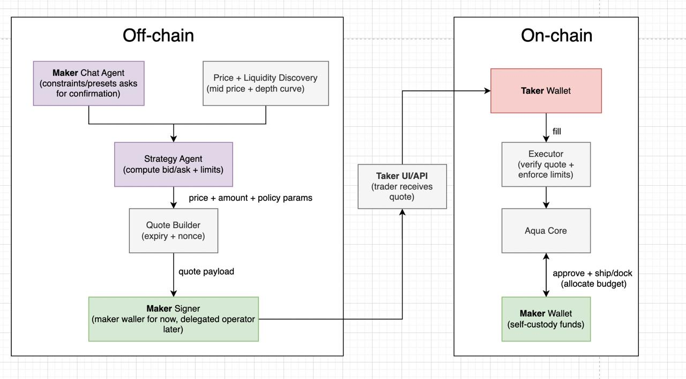

README

CryptoCatalyst: Aqua-based Agentic Strategist and Trader for Liquidity Providers

CryptoCatalyst generates trading strategies through a natural-language conversational interface agent for liquidity providers, as well as executing validated and signed token swaps on Ethereum-compatible chains. By harnessing the AQUA protocol by 1inch (https://github.com/1inch/aqua), CryptoCatalyst enables liquidity providers to earn currency by performing market-making functions and reduce their impermanence losses.  

___________________________________________________________________________________________

RFQ trading venue: http://144.126.239.201:5173/
API link: http://144.126.239.201:8080/docs#/

Trades
Real Trade via UI: https://basescan.org/tx/0x7feb206767ed70e4b09a2e7dd55f6be3828c09e7ce2c799b310fe26667bc4b10
Simulated Transaction: https://dashboard.tenderly.co/shared/simulation/72cff1d6-ea31-47bc-9463-a1d9c47e85a0

___________________________________________________________________________________________

Architecture: 

___________________________________________________________________________________________    

Core Components
1.	Strategy Agent (strategyAgentNew/)
•	Python Flask service that evaluates quote requests
•	Enforces maker policies (max trade size, price impact limits, stale pricing checks)
•	Computes strategy hashes (keccak256) matching on-chain computation
•	Returns ACCEPT/REJECT decisions with buy amounts, fees, and expiry
•	Deterministic: same inputs produce the same outputs
2.	Maker API (api/)
•	NestJS service orchestrating the quote flow
•	Receives quote requests from takers
•	Fetches pricing from the price engine
•	Calls the Strategy Agent for validation
•	Signs quotes using EIP-712
•	Stores quotes in PostgreSQL
•	Builds transaction payloads for on-chain execution
3.	Price Engine (price-engine/)
•	Market data service providing mid prices and liquidity depth curves
•	Aggregates data from multiple sources (DEXs, aggregators, oracles)
•	Returns depth points with price impact calculations
•	Includes quality metadata (confidence scores, staleness flags)
4.	Smart Contracts (contracts/)
•	AquaQuoteExecutor.sol: On-chain RFQ executor
•	Validates signed quotes, checks strategy status, and executes swaps
•	Integrates with Aqua for strategy-based liquidity management
•	Handles fee collection and settlement
5.	Maker Agent (makeragent/)
•	Conversational assistant for makers to configure quoting parameters
•	Helps set allowed pairs, trade limits, daily caps, and strategy selection
•	Generates transaction payloads for on-chain configuration
•	Requires explicit confirmation before any state changes
How It Works
1.	Taker requests a quote via the Maker API with token pair and amount
2.	API fetches pricing data from the Price Engine
3.	API calls the Strategy Agent with the request and pricing snapshot
4.	Strategy Agent validates against maker policies and computes:
•	Buy amount based on depth curve
•	Price impact (impactBps)
•	Fees (feeBps, feeAmount)
•	Strategy hash (on-chain compatible)
5.	If accepted, API signs the quote (EIP-712) and stores it
6.	Taker submits the signed quote to AquaQuoteExecutor on-chain
7.	Contract validates and executes the swap using Aqua strategies

   
Key Features 
- Deterministic quoting: same inputs produce identical quotes 
- Policy enforcement: maker-defined limits and constraints 
- On-chain compatibility: strategy hashes match Solidity computation 
- Price impact optimization: buys as much as possible at better prices 
- Rejection reasons: clear codes (STALE_PRICING, MAX_IMPACT_BPS_EXCEEDED, etc.) 
- Multi-chain support: Base, BNB Chain, and others 
  
Technology Stack 
- Backend: Python (Flask), TypeScript/Node.js (NestJS) 
- Blockchain: Solidity (Foundry), Web3.py, ethers.js 
- Database: PostgreSQL with TypeORM 
- APIs: REST with Swagger/OpenAPI documentation 
- Signing: EIP-712 structured data signing 
This system enables makers to provide liquidity through configurable strategies while ensuring quotes are valid, signed, and executable on-chain.
